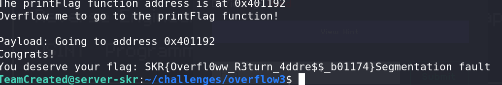

# Advanced Overflow - CTF Challenge Writeup

## Challenge Information
- **Name**: Advanced Overflow
- **Points**: 20
- **Category**: Binary

## Objective
The objective of the "Advanced Overflow" CTF challenge is to exploit a binary application by triggering a buffer overflow. Participants need to identify the correct offset to reach the overflow point, construct a payload, and execute the payload to jump to the desired function (in this case, the "win" function) to obtain the flag. This challenge serves as a practice exercise in buffer overflow exploitation.

## Solution
To successfully complete the "Advanced Overflow" challenge, I followed these steps to exploit the buffer overflow vulnerability and acquire the flag:

1. **Understanding the Challenge**:
   - The challenge is designed to test buffer overflow exploitation skills.
   - The goal is to determine the correct offset to trigger the overflow and jump to the "win" function.

2. **Finding the Offset**:
   - To find the correct offset, I conducted some testing and determined that the overflow could be triggered with an offset of 40 characters.

3. **Forming the Payload**:
   - I constructed the payload with the following elements:
     - 40 characters ("a") to reach the overflow point.
     - The address of the "win" function, which is required to jump to it.
   - The payload was built to exploit the buffer overflow vulnerability and execute the "win" function.

4. **Executing the Payload**:
   - I executed the payload using the following command:
     ```
     echo -en "aaaaaaaaaaaaaaaaaaaaaaaaaaaaaaaaaaaaaaaa\x92\x11\x40\x00" | ./overflow3
     ```

5. **Flag Retrieval**:
   - After successfully executing the payload, the program reached the "win" function, which resulted in the flag being displayed.


        

By identifying the correct offset, constructing a payload, and executing it to exploit the buffer overflow, I successfully obtained the flag for the "Advanced Overflow" challenge.

## Flag
The flag for this challenge is in the format `skr{XXXXXXXXXX}`. Participants should follow the provided steps to exploit the buffer overflow vulnerability by using the correct offset and payload to jump to the "win" function and retrieve the flag.

I hope this writeup provides valuable insights into how to approach and solve the "Advanced Overflow" CTF challenge, emphasizing the importance of buffer overflow exploitation skills. If you have any more questions or need further assistance, please feel free to ask.
