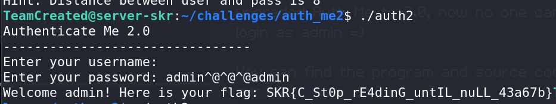

# Auth Me 2.0 - CTF Challenge Writeup

## Challenge Information
- **Name**: Auth Me 2.0
- **Points**: 218
- **Category**: Binary

## Objective
The objective of the "Auth Me 2.0" CTF challenge is to exploit a binary application's authentication mechanism to obtain the flag. The challenge involves examining the source code and utilizing a vulnerability to bypass the authentication check. Participants are encouraged to practice binary exploitation and stack manipulation techniques to achieve this goal.

## Solution
To successfully complete the "Auth Me 2.0" challenge, I followed these steps to exploit the authentication mechanism and acquire the flag:

1. **Accessing the Challenge**:
   - The challenge provided a webshell interface that was not working for me. To access the challenge, I opted to use SSH via the terminal.

2. **SSH Connection**:
   - I connected to the challenge server using the following command:
     ```
     ssh <your team name>@skrctf.me -p 5000
     ```
   - I provided my team password when prompted.

3. **Navigate to Challenge Directory**:
   - After successfully logging in, I navigated to the directory where the "Auth Me 2.0" challenge files were located.

4. **Analyzing the Source Code**:
   - I examined the source code of the binary to understand its authentication mechanism.
   - I noticed that the code used two instances of the `gets` function, one for the username and one for the password.

5. **Authentication Bypass**:
   - The challenge required that the username and password both be "admin."
   - However, the program had a check in place that would exit if it detected the username as "admin."


        

6. **Exploiting the Vulnerability**:
   - To bypass the authentication, I entered a username that was anything but "admin."
   - The challenge hints mentioned a keybind to enter an empty character, which was achieved using `CTRL + SHIFT + @`.
   - In the password field, I typed `admin@@@admin`. Here's why it works:
     - The variables in the stack follow a Last-In-First-Out (LIFO) principle.
     - Since the username is defined before the password in the code, the password field can overflow into the username.
     - By typing `admin@@@admin` into the password, it effectively sets both the username and password to "admin" without violating the username check.

7. **Flag Acquisition**:
   - With the authentication bypassed, I was able to log in with the username and password both set to "admin," and I obtained the flag.


        

By exploiting the authentication vulnerability in the "Auth Me 2.0" challenge, I successfully acquired the flag.

## Flag
The flag for this challenge is in the format `skr{XXXXXXXXXX}`. Participants should follow the provided steps to exploit the authentication mechanism by entering a specific combination of characters in the username and password fields.

I hope this writeup provides valuable insights into how to approach and solve the "Auth Me 2.0" CTF challenge, emphasizing binary exploitation and stack manipulation techniques. If you have any more questions or need further assistance, please feel free to ask.
