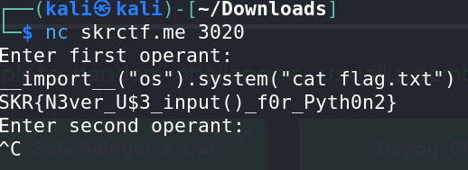

# Calculator - CTF Challenge Writeup

## Challenge Information
- **Name**: Calculator
- **Points**: 20
- **Category**: Miscellaneous

## Objective
The objective of the "Calculator" CTF challenge is to identify and exploit a Python 2 code snippet that contains an input vulnerability. Participants need to use this vulnerability to execute arbitrary code and obtain the flag. The challenge focuses on understanding and leveraging the behavior of Python 2's `input()` function, which evaluates user input as Python code.

## Solution
To successfully complete the "Calculator" challenge, I followed these steps to exploit the input vulnerability and retrieve the flag:

1. **Understanding Python 2 Input Behavior**:
   - Python 2's `input()` function evaluates user input as Python code, similar to Python 3's `eval()` function.
   - This behavior allows us to execute arbitrary code if we can craft the input correctly.

2. **Analyzing the Code**:
   - I examined the provided Python 2 code and noticed the use of the `input()` function for user input.
   - The code did not have any explicit sanitization or filtering of user input, making it a potential target for exploitation.

3. **Executing Arbitrary Code**:
   - To exploit the vulnerability, I crafted my input to execute arbitrary code.
   - I used the `__import__("os")` statement to import the Python `os` module and execute system commands.

4. **Retrieving the Flag**:
   - Using the imported `os` module, I executed the `cat flag.txt` command to read the contents of the `flag.txt` file.
   - The flag content was displayed as part of the program's output.

        

By leveraging the Python 2 `input()` function's behavior, I successfully executed arbitrary code and obtained the flag for the "Calculator" challenge.

## Flag
The flag for this challenge is in the format `skr{XXXXXXXXXX}`. Participants should follow the provided steps to exploit the Python 2 code's input vulnerability and execute the necessary commands to retrieve the flag.

I hope this writeup provides a clear understanding of how to approach and solve the "Calculator" CTF challenge by utilizing the Python 2 input vulnerability to execute remote code and obtain the flag. If you have any more questions or need further assistance, please feel free to ask.
