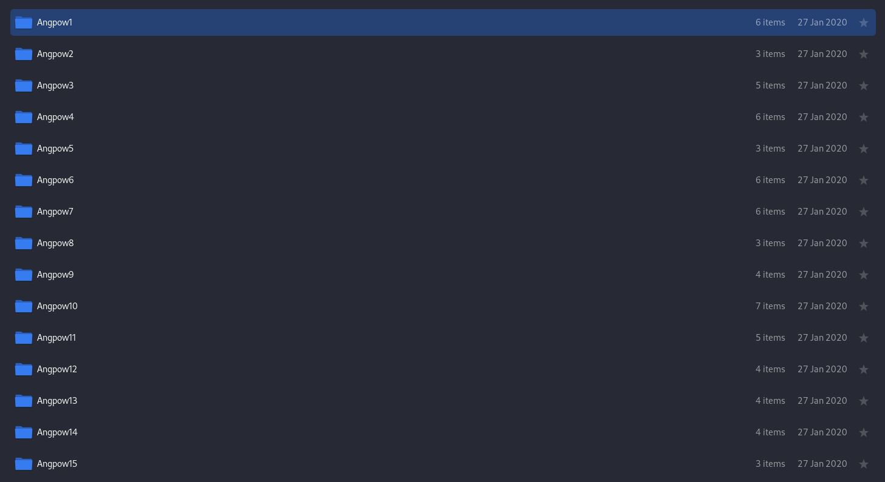

# Happy CNY! - CTF Challenge Writeup

## Challenge Information
- **Name**: Happy CNY!
- **Points**: 20
- **Category**: Miscellaneous

## Objective
The objective of the "Happy CNY!" CTF challenge is to test your meticulousness and problem-solving skills. You are provided with a zip file and tasked with uncovering the flag hidden within it. The flag is constructed using ASCII representations of characters found in various "angpow" (red envelope) folders. Participants have two methods to choose from: a tedious manual approach or a programmatic solution. This challenge aims to teach participants about the importance of attention to detail and the benefits of scripting.

## Solution
To successfully complete the "Happy CNY!" challenge, I present two methods to choose from:

### Method 1: Tedious Manual Approach

1. **Unzipping the Zip File**:
   - Begin by unzipping the provided zip file.
   - For convenience, consider using a graphical user interface (UI) rather than the terminal for this challenge.

      

2. **Browsing Unzipped Folders**:
   - After unzipping the file, explore the contents within the unzipped folders.

3. **Sorting by Alphabetical Order**:
   - To organize the data for systematic analysis, sort the folders by alphabetical order.

      

4. **Inspecting Each Folder**:
   - Proceed to look through each folder to count the amount of "money" in each "angpow" (red envelope).
   - These will resemble ASCII representations of characters.
   
5. **Flag Reconstruction**:
   - Count the ASCII characters for all the alphabets in the angpow envelopes.
   - Assemble these characters to construct the flag in the format `skr{XXXXXXXXXX}`.

### Method 2: Programmatic Approach (Python)

1. **Using Python**:
   - Start by using Python to read the files within the unzipped folders.
   - This approach offers automation and efficiency.

2. **Identify File Sizes**:
   - Once you can read the files in Python, determine the size of each angpow money file.
   - Different money denominations have distinct file sizes.

      

3. **Scripting**:
   - With the file sizes identified, create a script to automate the process of counting and collecting the ASCII characters.
   - The script will assemble the characters to form the flag.
   - You can see `smart.py` for this implementation

By choosing either the manual or programmatic approach, participants can successfully uncover the hidden flag for the "Happy CNY!" challenge.

## Flag
The flag for this challenge is in the format `skr{XXXXXXXXXX}`. Participants should select their preferred method, either manual or programmatic, to examine the contents of the zip file and collect the ASCII characters from the angpow envelopes to construct the flag.

I hope this writeup provides valuable insights into how to approach and solve the "Happy CNY!" CTF challenge, highlighting both manual and programmatic methods. If you have any more questions or need further assistance, please feel free to ask.
