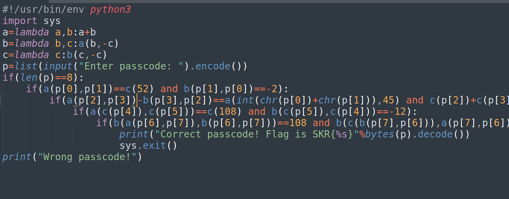

# Ular Challenge 2 - CTF Challenge Writeup

## Challenge Information
- **Name**: Ular Challenge 2
- **Points**: 364
- **Category**: Reverse Engineering

## Objective
The objective of the "Ular Challenge 2" CTF challenge is to demonstrate your reverse engineering skills by understanding and solving a heavily obfuscated challenge file. The challenge file contains a series of anonymous functions that you must decipher. By solving the mathematical equations within the challenge file, you will determine the password required to obtain the flag. This challenge aims to teach participants about deobfuscation and reverse engineering techniques.

## Solution
To successfully complete the "Ular Challenge 2" challenge, I followed these steps:

1. **Understanding Anonymous Functions**:
   - The challenge file is heavily obfuscated, but with careful analysis, I was able to decipher the functionality of the anonymous functions.
   - I recognized that:
     - Anonymous function `a` represents addition.
     - Anonymous function `b` represents subtraction.
     - Anonymous function `c` takes an input and multiplies it by 2.

        

2. **Deciphering the Password**:
   - The challenge requires finding an 8-character password, and I assigned an alphabet to each element in the password.
   - I used algebra to translate the mathematical equations in the challenge file into expressions involving these alphabetic variables.

3. **Solving the Equations**:
   - For each mathematical equation, I solved it to find the corresponding password character.
   - For example, the equation `a(p[0],p[1])==c(52)` translates to `A + B = 104`.
   - `b(p[1],p[0])==-2` translates to `A - B = -2`
   - `a(p[2],p[3])-b(p[3],p[2])==a(int(chr(p[0])+chr(p[1])),45)` translates to `(C+D)-(D-C) = 98`
   - `c(p[2])+c(p[3])==b(-1141,-1337)` translates to `2D + 2C = 196 `

4. **Repeating for All Checks**:
   - I performed the same process for all the mathematical checks in the challenge file.
   - By solving each equation and collecting the corresponding password characters, I constructed the entire password.

5. **Obtaining the Flag**:
   - Once I had the complete password, I used it to obtain the flag for the challenge.
   - The flag is usually presented in the format `skr{XXXXXXXXXX}`, where you replace 'XXXXXXXXXX' with the characters you deciphered.

      

By understanding and solving the mathematical equations within the challenge file, I successfully extracted the password required to unlock the flag for the "Ular Challenge 2."

## Flag
The flag for this challenge is in the format `skr{XXXXXXXXXX}`. Participants should follow the provided steps to decipher the password by solving the mathematical equations and unlock the flag.

I hope this writeup provides valuable insights into how to approach and solve the "Ular Challenge 2" CTF challenge, emphasizing reverse engineering and deobfuscation techniques. If you have any more questions or need further assistance, please feel free to ask.
