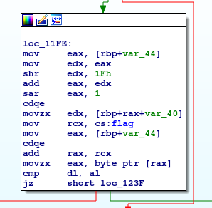
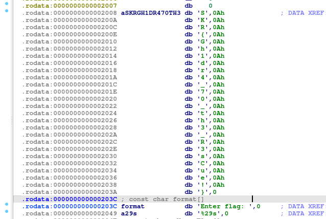

# nogard1 - CTF Challenge Writeup

## Challenge Information
- **Name**: nogard1
- **Points**: 20
- **Category**: Reverse Engineering

## Objective
The objective of the "nogard1" CTF challenge is to demonstrate your basic reverse engineering skills by analyzing a simple binary file. The challenge file contains code that performs a string comparison with a hardcoded string within the program. Your task is to uncover the flag by identifying the correct string. This challenge serves as a great introduction to reverse engineering for beginners.

## Solution
To successfully complete the "nogard1" challenge, I followed these straightforward steps:

1. **Analyze the Binary**:
   - Open the provided binary file in a reverse engineering tool like Ghidra or IDA.
   - In this instance, I chose to use IDA for the analysis.

2. **Inspect the Code**:
   - Examine the disassembled code within the reverse engineering tool.
   - Pay close attention to any parts of the code where string comparison or flag verification occurs.

3. **Identify the Hardcoded String**:
   - While analyzing the code, you may find that the program compares the flag input against a hardcoded string within the binary.

        

4. **Extract the Flag**:
   - Once you identify the hardcoded string, it will be the flag for the challenge.
   - The flag is typically presented in the format `skr{XXXXXXXXXX}`, where you replace 'XXXXXXXXXX' with the characters in the discovered string.

        

The "nogard1" challenge provides a straightforward introduction to reverse engineering. By analyzing the code and identifying the hardcoded string, you can successfully uncover the flag.

## Flag
The flag for this challenge is in the format `skr{XXXXXXXXXX}`. Participants should follow the provided steps to inspect the code within the binary and discover the hardcoded string, which represents the flag.

I hope this writeup offers guidance on how to approach and solve the "nogard1" CTF challenge, especially for those who are new to reverse engineering. If you have any more questions or need further assistance, please feel free to ask.
