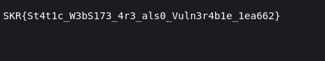

# Dot Dot Slash - CTF Challenge Writeup

## Challenge Information
- **Name**: Dot Dot Slash
- **Points**: 20
- **Category**: Web

## Objective
The objective of the "Dot Dot Slash" CTF challenge is to exploit a web application's directory traversal vulnerability to access and retrieve the flag file. Participants need to navigate through the application's file structure and locate the flag.txt file, which is stored two directories above the assets directory. This challenge provides an opportunity to practice and demonstrate directory traversal techniques in a web context.

## Solution
To successfully complete the "Dot Dot Slash" challenge, I followed these steps to exploit the directory traversal vulnerability and acquire the flag:

1. **Understanding the Challenge**:
   - The challenge focuses on directory traversal, where the goal is to access and retrieve the flag file (flag.txt).
   - We know that the flag.txt file is located two directories above the assets directory.

2. **Formulating the Path**:
   - I constructed a path that would traverse two directories above the current location. This is achieved by using `../` to go up one directory and repeating it to go up two directories.
   - The path should look like `../../flag.txt`.

3. **Encoding the Path**:
   - For some reason, using `../../flag.txt` directly in the URL won't retrieve the flag.
   - To make the path work, I needed to URL-encode it. URL encoding changes special characters into a format that can be safely transmitted as part of a URL.
   - In this case, I URL-encoded `../` as `..%2F`, resulting in the path `..%2F..%2Fflag.txt`.

4. **Accessing the Flag**:

    
    

By exploiting the directory traversal vulnerability and correctly formulating and encoding the traversal path, I successfully obtained the flag for the "Dot Dot Slash" challenge.

## Flag
The flag for this challenge is in the format `skr{XXXXXXXXXX}`. Participants should follow the provided steps to exploit the directory traversal vulnerability by constructing and encoding the traversal path to access and retrieve the flag.txt file.

I hope this writeup provides valuable insights into how to approach and solve the "Dot Dot Slash" CTF challenge, emphasizing the importance of understanding and exploiting directory traversal vulnerabilities in web applications. If you have any more questions or need further assistance, please feel free to ask.
