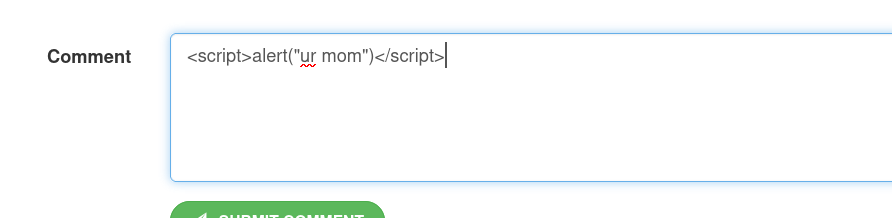
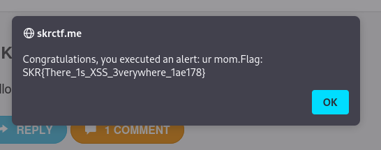

# My First XSS - CTF Challenge Writeup

## Challenge Information
- **Name**: My First XSS
- **Points**: 20
- **Category**: Web

## Objective
The objective of the "My First XSS" CTF challenge is to identify and exploit a simple Cross-Site Scripting (XSS) vulnerability in a web application. Participants are presented with a web page where they can inject arbitrary JavaScript code. The challenge tests the ability to recognize and execute XSS attacks.

## Solution
To successfully complete the "My First XSS" challenge, I followed these steps to exploit the XSS vulnerability and acquire the flag:

1. **Understanding the Challenge**:
   - The challenge presents a web page with a text input field where you can enter JavaScript code.
   - The objective is to execute arbitrary JavaScript code to trigger an XSS attack.

2. **Injecting JavaScript**:
   - In the text input field, I injected a simple JavaScript alert statement within ``.
   - The message within the `alert` function can be any text you choose.

        

3. **Executing JavaScript**:
   - After entering the JavaScript code and submitting it, the web application executed the JavaScript code.
   - The result was an alert dialog displaying the message, indicating a successful XSS attack.

4. **Accessing the Flag**:
   - Upon executing the JavaScript code, the application provided me with the flag.
   - It didn't matter what I put within the `<script>` tags; as long as I successfully executed JavaScript, the flag was awarded.

        

By injecting and executing JavaScript code within the text input field, I successfully triggered an XSS attack and obtained the flag for the "My First XSS" challenge.

## Flag
The flag for this challenge is in the format `skr{XXXXXXXXXX}`. Participants should follow the provided steps to recognize and exploit the XSS vulnerability by injecting and executing JavaScript code to trigger the flag.

I hope this writeup provides valuable insights into how to approach and solve the "My First XSS" CTF challenge, emphasizing the importance of understanding and identifying XSS vulnerabilities in web applications. If you have any more questions or need further assistance, please feel free to ask.
