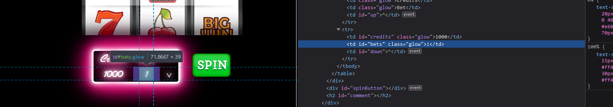
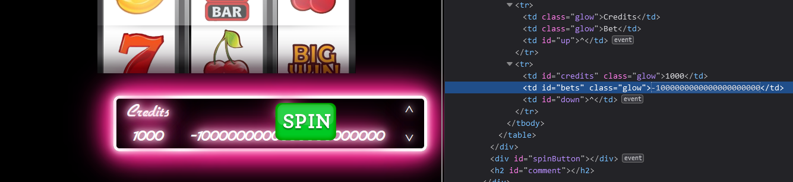
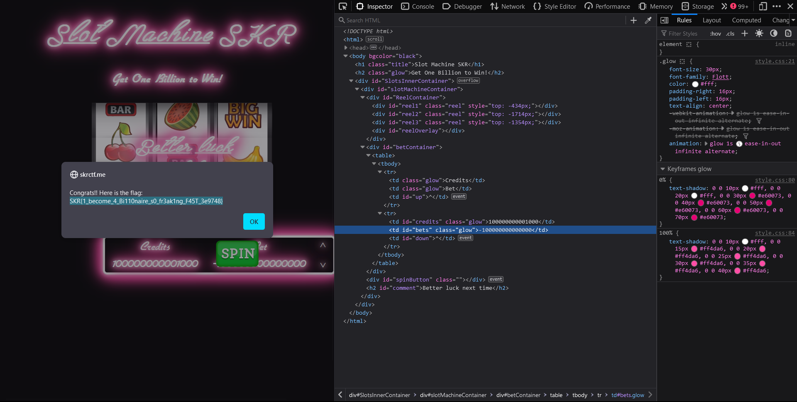

# Slot Machine - CTF Challenge Writeup

## Challenge Information
- **Name**: Slot Machine
- **Points**: 20
- **Category**: Web

## Objective
The objective of the "Slot Machine" CTF challenge is to uncover a vulnerability in the web application and exploit it to reveal the flag. The challenge simulates a slot machine where you can place bets, but a hidden flaw allows you to manipulate the system. Your goal is to identify this flaw and exploit it to obtain the flag. This challenge provides an opportunity to learn about input validation and unintended behaviors in web applications.

## Solution
To successfully complete the "Slot Machine" challenge, I discovered a vulnerability in the system and exploited it as follows:

1. **Understand the Vulnerability**:
   - While playing the slot machine, I noticed an interesting behavior.
   - When I placed a negative bet, my points increased instead of decreasing.
   - This behavior suggested that the application likely performs a subtraction operation like `points = points - bet` when deducting points.

2. **Leverage the Vulnerability**:
   - I realized that by using a large negative number as the bet, I could make my points increase significantly.
   - This was the key to exploiting the vulnerability and revealing the flag.

        
        

3. **Reveal the Flag**:
   - To obtain the flag, I placed a large negative bet in the slot machine.
   - The system, due to its unintended behavior, increased my points, effectively printing the flag as a result.

        

By understanding and exploiting the vulnerability related to negative bets, I successfully revealed the flag for the "Slot Machine" challenge.

## Flag
The flag for this challenge is in the format `skr{XXXXXXXXXX}`. Participants should follow the provided steps to take advantage of the vulnerability and use a large negative number as a bet to obtain the flag.

I hope this writeup provides valuable insights into how to approach and solve the "Slot Machine" CTF challenge, highlighting the importance of input validation in web applications and identifying unintended behaviors. If you have any more questions or need further assistance, please feel free to ask.
